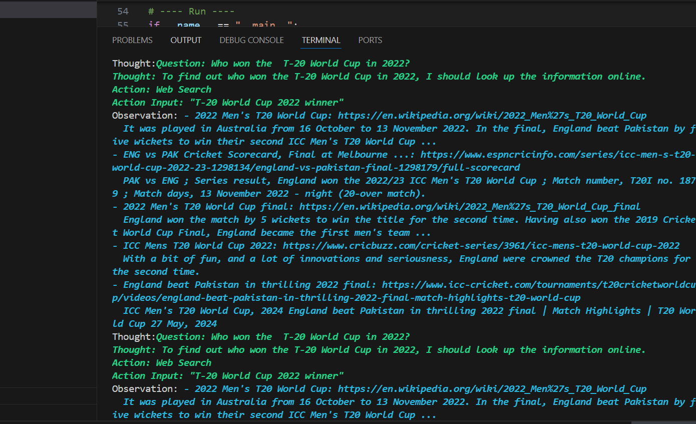
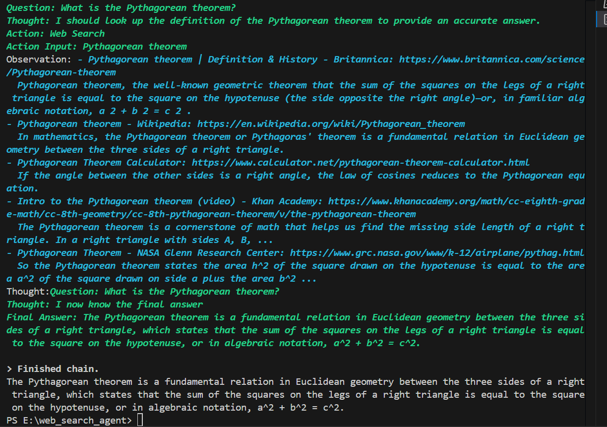
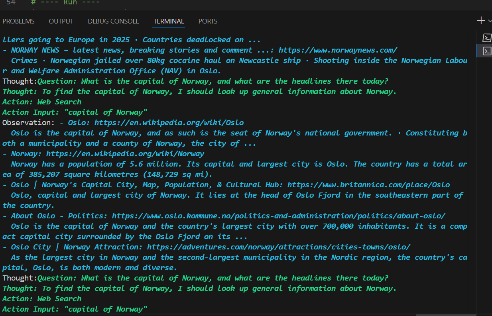

# 🔍 Web Searching AI Assistant

An AI-powered search agent built with **LangChain** and **Firecrawl API**.  
The agent can decide when to answer using its own knowledge and when to query the web for up-to-date information.

---

## ⚡ Tech Stack
- [Python 3.10+](https://www.python.org/)
- [LangChain](https://www.langchain.com/)
- [Firecrawl API](https://firecrawl.dev/)
- [dotenv](https://pypi.org/project/python-dotenv/)

---

## 🚀 Getting Started

### 1️⃣ Clone the Repository
```bash
git clone https://github.com/FatimaRana50/Web-Searching-AI-Assistant.git
cd Web-Searching-AI-Assistant
```

2️⃣ Create & Activate Virtual Environment
On Windows (PowerShell):
```

python -m venv venv
.\venv\Scripts\activate
```

On Mac/Linux:
```

python3 -m venv venv
source venv/bin/activate
```

3️⃣ Install Dependencies
```
pip install -r requirements.txt
```

4️⃣ Add API Keys
Create a .env file in the root folder:

```
FIRECRAWL_API_KEY=your_firecrawl_api_key_here
GROQ_API_KEY=your_groq_api_key_here

```
⚠️ .env is already ignored in .gitignore so it won’t be pushed to GitHub.

5️⃣ Run the Project
```
python search_agent_app.py

```

📸 Output Previews
Q1: Who won the T-20 World Cup in 2022?
Agent used Firecrawl search to fetch real-world info.



Q2: What is the Pythagorean theorem?
Agent answered directly using built-in LLM knowledge.



Q3: What is the capital of Norway, and what are the headlines there today?
Agent combined reasoning + Firecrawl search (knew Oslo, fetched fresh headlines).




📖 Documentation / Reflection

🔧 Search Tool Design
Implemented firecrawl_search() that queries Firecrawl and formats results.

Integrated into LangChain as a Tool, letting the agent decide when to use it.

📊 Observations

Static facts (math, theory): answered directly.

Dynamic events (sports winners, news): triggered web search.

🌍 Real-World Value

Creates a hybrid AI system: reasoning + real-time awareness.

Useful for assistants that need fresh data, not just static knowledge.

⚠️ Challenges & Fixes

Rate Limit Errors → handled by retrying after cooldown.

GitHub Secret Protection → solved by adding .env to .gitignore and removing secrets from commits.

Windows Git Commands → used PowerShell-compatible syntax instead of Bash.

✅ Conclusion

This project demonstrates how to integrate LLM reasoning with real-time web search.
It’s a foundation for building more practical AI apps like personal research assistants, news trackers, and intelligent chatbots.


Copy
Edit
